<picture>
  <source media="(prefers-color-scheme: dark)" srcset="assets/header-dark.svg">
  
</picture>

 

## Minha Stack

<picture>
  <source media="(prefers-color-scheme: dark)" srcset="assets/stack-dark.svg">
  
</picture>

 

  
<picture>
  <source media="(prefers-color-scheme: dark)" srcset="https://quotes-github-readme.vercel.app/api?type=horizontal&theme=dark">
  
</picture>
  
[**LinkedIn**](https://www.linkedin.com/in/andrefelipedsr) &nbsp;·&nbsp; [**GitHub**](https://github.com/andrefelipedsr)
 

